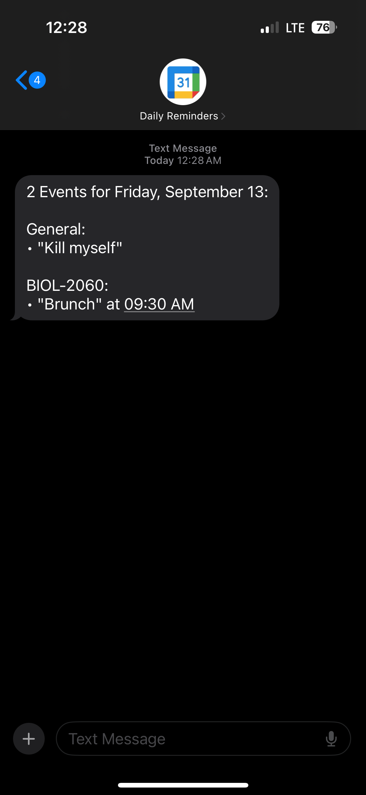

# Daily Google Calendar SMS Reminders

The stress is picking up so I thought I'd share a new tool I made.
It sends you a text to yourself every morning with your current Google Calendar events, split by calendar.

To set it up you need to:

1. Enable Calendars Google API
2. Create OAuth Client Credentials & create `./resources/app_credentials.json`
4. Create a Twilio account & create `./resources/sms_credentials.json`
5. Run `pip install -r requirements.txt` to install dependencies
6. Run `authenticate.py` to generate `user_credentials.json`
7. Run `main.py` on a VPS/server to send yourself a text message daily

Set up `./resources` folder with the following files:

- `app_credentials.json` (your OAuth Client Credentials from Google Cloud Console)
- `sms_credentials.json` (following the format below)

### sms_credentials.json

```json
{
  "account_sid": "",
  "auth_token": "",
  "from_number": "+1XXXYYYZZZZ",
  "to_number": "+1XXXYYYZZZZ"
}
```

## Sample Result

